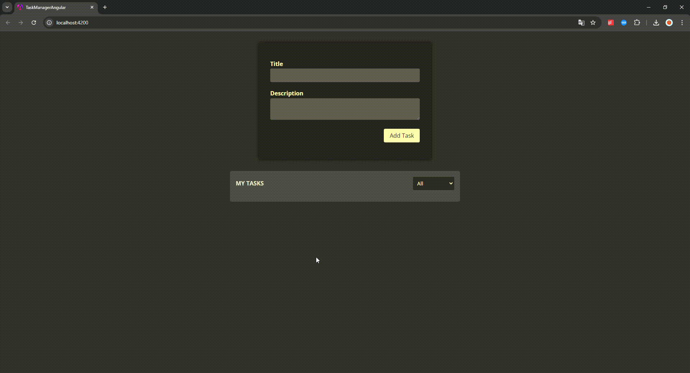

# TaskManagerAngular

### Documentation for **TaskManagerAngular**

#### Overview

**TaskManagerAngular** is a frontend application built with Angular for managing tasks. The project is organized into modular components, services, and models to facilitate task creation, listing, and interaction.

---



---

### Project Structure

#### Main Directories and Files

- **`src/app/`**: Contains the core application logic, components, and services.
  - **tasks/**:
    - **`new-task/`**: Handles the creation of new tasks.
    - **`tasks-list/`**:
      - `tasks-list.component.ts`: Displays the list of tasks.
      - `tasks-list.component.html`: HTML template for the task list.
      - `tasks-list.component.css`: Component-specific styling for the task list.
    - **`task-item/`** (not explicitly shown but presumed as part of task handling): Likely handles individual task components.
    - `tasks.component.ts`: Parent component that integrates task features.
    - `tasks.service.ts`: Provides business logic and state management for tasks.
    - `task.model.ts`: Defines the data structure for a task.
  - **Services**:
    - **`logging.service.ts`**: Logs actions or errors across the application.
  - **Global Files**:
    - `app.component.ts`: Root component for the application.
    - `styles.css`: Global styles for the application.
    - `main.ts`: Application entry point.

---

### Key Features

1. **Task Management**:
   - Add new tasks with the **new-task** component.
   - Display all tasks using the **tasks-list** component.
   - Modularized logic and reusable components.
2. **State Management**:

   - `tasks.service.ts` handles task-related operations and centralizes state.

3. **Logging**:
   - `logging.service.ts` tracks application actions and logs events for debugging.

---

### How to Run the Project

1. Clone the repository:

   ```bash
   git clone https://github.com/FilonenkoDima/TaskManagerAngular.git
   cd TaskManagerAngular
   ```

2. Install dependencies:

   ```bash
   npm install
   ```

3. Start the development server:
   ```bash
   ng serve
   ```
   The application will be accessible at `http://localhost:4200/`.

---

### Technologies Used

- **Framework**: Angular
- **Styling**: CSS
- **State Management**: Angular services
- **Version Control**: GitHub

---

### Contribution Guidelines

1. Fork the repository.
2. Create a new branch:
   ```bash
   git checkout -b feature/your-feature-name
   ```
3. Commit your changes and push the branch:
   ```bash
   git push origin feature/your-feature-name
   ```
4. Submit a pull request for review.
